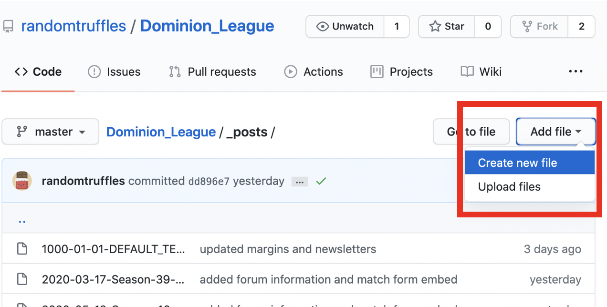
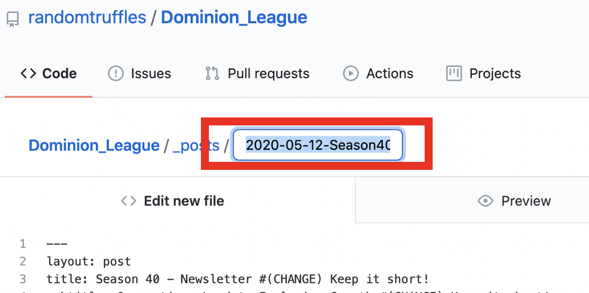
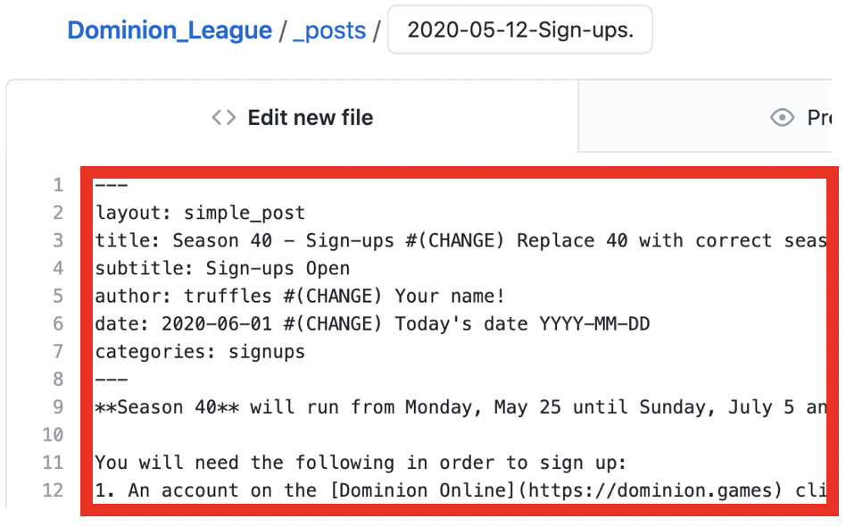
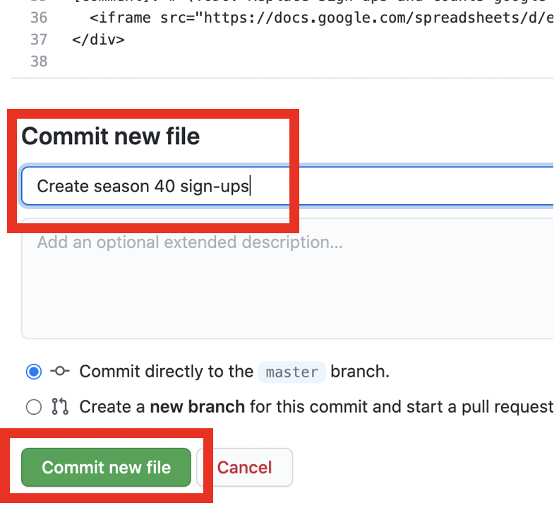
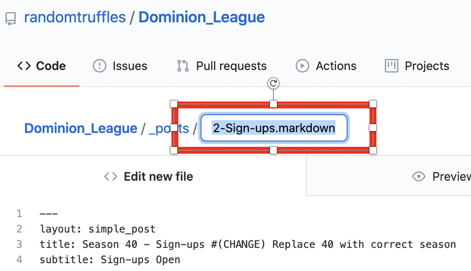
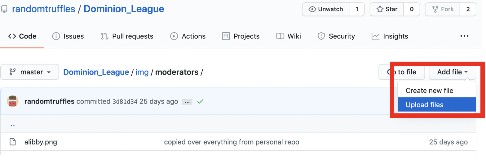

## League Moderator Guide

This page serves as a guide for league moderators navigating the website.

### Contents
1. <a href="#1-prerequisites">Prerequisites</a> - Getting Set Up
2. <a href="#2-writing-a-post">Writing a Post</a> - Signups, Newsletters, Deadlines...
3. <a href="#3-editing-a-post">Editing a Post</a> - Rules, FAQ..
4. <a href="#4-deleting-posts">Deleting Posts</a>
5. <a href="#5-editing-moderator-list">Editing Moderator List</a> - and moderator pictures
6. <a href="#6-adding-youtube-channel-to-database">Adding Player Youtube Channel to Player Database</a>
7. <a href="https://github.com/randomtruffles/Dominion_League/blob/master/README.md">How the Website Repository Works</a> (in progress)
<hr style="border-top: 1px solid darkgray">

### 1. Prerequisites
<div class="instructions-div" markdown="1">
1. Create a [Github](https://github.com/) account.
2. Message `@truffles#9347` on discord to give you access to edit the website.
3. The repository is located here: <https://github.com/randomtruffles/Dominion_League>

**OR**
1. Use the following Github credentials:
* Username:

Once you have access, you will be good to go to make changes!
</div>

<hr style="border-top: 1px solid darkgray">

### 2. Writing a Post

#### Type of Posts
<div class="instructions-div" markdown="1">
- <a href="#generic-type">Generic Post</a> - Newsletters, interesting thoughts
- <a href="#sign-up-post">Sign Up Post</a> - Sign-up post
</div>

#### Generic Type
Make sure you have completed the <a href="#1-prerequisites">Prequisites</a> before attempting to make a post.
<br>
Example can be found here: [example of newsletter post](https://raw.githubusercontent.com/randomtruffles/Dominion_League/master/_posts/2020-05-12-Season-40-Newsletter.md)
<div class="instructions-div" markdown="1">
1. Navigate to where posts are created: [Github Repository](https://github.com/randomtruffles/Dominion_League/tree/master/_posts)

2. Click the **Add file > Create new file** button, on the right above the file directory.


3. It will prompt you to enter a name for the file.
<br>
* Format of file name must be: `yyyy-mm-dd-TITLE.md`
* Replace `TITLE` with something relevant to the post. It will become the URL of the page. <br>*Do not include spaces in the title*
* Examples:
  ```
  2017-04-22-Season40-Newsletter.md
  2020-06-01-Championship-Match-Summary.md
  ```

3. Edit the file by first adding a mandatory header (see example below). **If you are copying over text with a header already, skip to Step 4.**
```
---
layout: post
title: Season 40 - Newsletter #(CHANGE) Keep it short!
subtitle: Quarantines Lead to Explosive Growth #(CHANGE) Keep it short!
author: truffles #(CHANGE) Your name!
date: 2020-06-01 #(CHANGE) Today's date YYYY-MM-DD
categories: pinned #(OPTIONAL) Delete this line if you don't want it pinned.
---
```
* **Important:** Lines with `(CHANGE)` require you to make changes.
* Lines with `(OPTIONAL)` can be deleted, ie. deleting `categories: pinned` will remove it from the pinned section in the <a href="https://dominionleague.org/posts.html">Posts page</a>
* Text in the header after `#` are __comments__ and will be ignored by the website generator.
* The header configures how the page will look (the layout, the title, date etc.)
* Example of a [previous Newsletter post](https://raw.githubusercontent.com/randomtruffles/Dominion_League/master/_posts/2020-05-12-Season-40-Newsletter.md) with a header and contents.

4. Add the full content (written in markdown) below the header.
<br>
5. Commit the post! Scroll to the bottom of the page to __Commit New File__.
* Add a description to let league mod contributors know what you did. Something short will suffice.
```
Create season 40 sign-ups
```
* Click the **Commit New File** button. Wait a few seconds, and it should be live!

</div>
<hr style="border-top: 1px solid darkgray">

#### Sign Up Post
<div class="instructions-div" markdown="1">
Make sure you have completed the <a href="#1-prerequisites">Prequisites</a> before attempting to make a sign up post.
<br>
Example can be found here: [example of signup post](https://raw.githubusercontent.com/randomtruffles/Dominion_League/master/_posts/2020-06-01-Sign-ups.md)
1. Navigate to where posts are created: [Github Repository](https://github.com/randomtruffles/Dominion_League/tree/master/_posts)

2. Click the **Add file > Create new file** button, on the right above the file directory.


3. It will prompt you to enter a name for the file.
<br>
* Format of file name must be: `yyyy-mm-dd-Sign-ups.md`
* Examples:
  ```
  2017-04-22-Sign-ups.md
  2020-06-01-Sign-ups.md
  ```

4. Edit the file by first including a header (see below) and then with the contents of the post (it must be in markdown).
* Include a **mandatory** header (this will configure the layout of the page, the title, date etc.) -  see example below and a [previous post](https://raw.githubusercontent.com/randomtruffles/Dominion_League/master/_posts/2020-06-01-Sign-ups.md).
* Header for you to copy/edit/add to the top of your file. Text after `#` are comments and will be ignored.
  * **Important:** Lines with `(CHANGE)` require you to make changes.
```
---
layout: simple_post
title: Season 40 - Sign-ups #(CHANGE) Replace 40 with correct season
subtitle: Sign-ups Open
author: truffles #(CHANGE) Your name!
date: 2020-06-01 #(CHANGE) Today's date YYYY-MM-DD
categories: signups
---
```
* Add the content (in markdown) below the header.
<br>
5. Commit the post! Scroll to the bottom of the page to __Commit New File__.
* Add a description to let league mod contributors know what you did. Something short will suffice.
```
Create season 40 sign-ups
```
* Click the **Commit New File** button. Wait a few seconds, and it should be live!

</div>
<hr style="border-top: 1px solid darkgray">

### 3. Editing a Post
<div class="instructions-div" markdown="1">
Make sure you have completed the <a href="#1-prerequisites">Prequisites</a> before attempting.
<br>
#### Types of Posts to Edit
- <a href="#edit-rules-page">Rules and Regulations</a>
- <a href="#edit-faq-page">F.A.Q.</a>
- <a href="#edit-other-posts">Other Posts</a> - Newsletters, Signups, etc.

#### Edit Rules Page
1. Navigate here: [Rules Page](https://github.com/randomtruffles/Dominion_League/edit/master/rules.md)
2. Edit the `name` (to your own name) and the `date` (to today's date in yyyy-mm-dd format) in the header if you are making major changes.
```
---
title: League Rules
subtitle: Official Rules of the Dominion League
layout: post
date: 2020-05-29 # CHANGE
categories: pinned rules
author: SamE # CHANGE
---
```
3. Edit the content in the file directly (make sure you are writing in markdown).
4. Scroll to bottom and click the `Commit changes` button.
5. Wait a few seconds for your changes to be live!

#### Edit FAQ Page

1. Navigate here: [FAQ Page](https://github.com/randomtruffles/Dominion_League/edit/master/faq.md)
2. Edit the `name` (to your own name) and the `date` (to today's date in yyyy-mm-dd format) in the header if you are making major changes.
```
---
title: Dominion League FAQ
subtitle: Frequently Asked Questions for the Dominion League
layout: post
date: 2020-05-20 # CHANGE
categories: pinned faq
author: SamE # CHANGE
---
```
3. Edit the content in the file directly (make sure you are writing in markdown).
4. Scroll to bottom and click the `Commit changes` button.
5. Wait a few seconds for your changes to be live!

#### Edit Other Posts

1. Navigate to the <a href="https://github.com/randomtruffles/Dominion_League/tree/master/_posts">posts directory</a> on Github.
2. Look for the relevant post you want to edit.
* Posts are named `YYYY-MM-DD-TITLE.md` to give you insight on what the post is.
3. Click on the relevant file for the post.
4. In the relevant post, click the edit symbol on the right of the header to go into edit mode.

5. Edit the post directly (make sure you are writing in markdown)
6. Scroll down the to bottom of the page and then click the `Commit changes` button.
Wait a few seconds and your changes will be live!
</div>
<hr style="border-top: 1px solid darkgray">

### 4. Deleting Posts
<div class="instructions-div" markdown="1">
Make sure you have completed the <a href="#1-prerequisites">Prequisites</a> before attempting to delete a post.
1. Navigate to the [posts directory](https://github.com/randomtruffles/Dominion_League/tree/master/_posts) on Github.
2. Click on the relevant post file that you want to delete.
3. Once in the relevant post file, click on the delete button.

4. Clicking on the delete button will redirect you to confirm the post you are deleting. Scroll to the bottom of that page and click the `Commit Changes` button.
<br>

</div>

<hr style="border-top: 1px solid darkgray">

### 5. Editing Moderator List
<div class="instructions-div" markdown="1">
Make sure you have completed the <a href="#1-prerequisites">Prequisites</a> before attempting.
1. Navigate to the [moderator list file](https://github.com/randomtruffles/Dominion_League/edit/master/_data/moderators.yml) on Github.
2. Template of adding a new moderator
* `name`: the name of the moderator
* `discord`: the discord handle id (eg. `truffles#1234`)
* `image` : the name of the image file that **must** end in `.png`
  * If the file is `truffles_picture.png`, fill in `truffles_picture`
  * If the file is `screenshot_1234.png` fill in `screenshot_1234`
  * Instructions on where to add the image file begins in step 5.
```
# TEMPLATE OF NEW MODERATOR
- name: truffles
  discord: truffles#1234
  image: truffles_picture_png_file_prefix
```
3. Insert the moderator in the correct position alphabetically.
* To **remove a moderator**, simply delete the lines from the file (name, discord, image.
4. Scroll to the bottom of the page and click the `Commit changes` button.
5. Navigate here to where moderator images are stored: [moderator images](https://github.com/randomtruffles/Dominion_League/tree/master/img/moderators)
6. Click the **Add File > Upload Files** on the right on the page.

7. Upload the file by following the instructions on the page.
* Note: The file name should be in the format `.png`, with the prefix being the same that you entered in step 2.
8. Scroll to the bottom of the page and click `Commit changes`.

Wait a few moments and it should be updated on the site!
</div>

### 6. Adding Youtube Channel To Database
<div class="instructions-div" markdown="1">
Make sure you have completed the <a href="#1-prerequisites">Prequisites</a> before attempting.
1. Navigate to the [file storing youtube channels](https://github.com/randomtruffles/Dominion_League/edit/master/_data/youtube_channels.json) on Github.
2. Edit and add the relevant channel information to the file.
* **Important:** Don't forget adding a `,` after where you inserted.
* Make sure you don't have any "comments" in the file. Anything from `#` and afterwards is a comment (eg. `# DON'T FORGET THIS COMMA`)
```
...
  },
  "last_old_player_in_file" : {
    "channel" : "https://www.youtube.com/channel/UCAgje77cB9YRmo7ASNojn2Q?view_as=subscriber"
  }, # DON'T FORGET THIS COMMA
  "new_player_to_add_in_file" : {
    "channel" : "https://www.youtube.com/channel/UCAgje77cB9YRmo7ASNojn2Q?view_as=subscriber"
  }
} # end of file
```
3. Scroll to the bottom of that page and click the `Commit Changes` button.
4. Check that it's been updated when you search for the player in the database.
</div>

### 7. How the Website Works
* In progress, but you can read the [README.md](https://github.com/randomtruffles/Dominion_League/blob/master/README.md) for a good idea.
